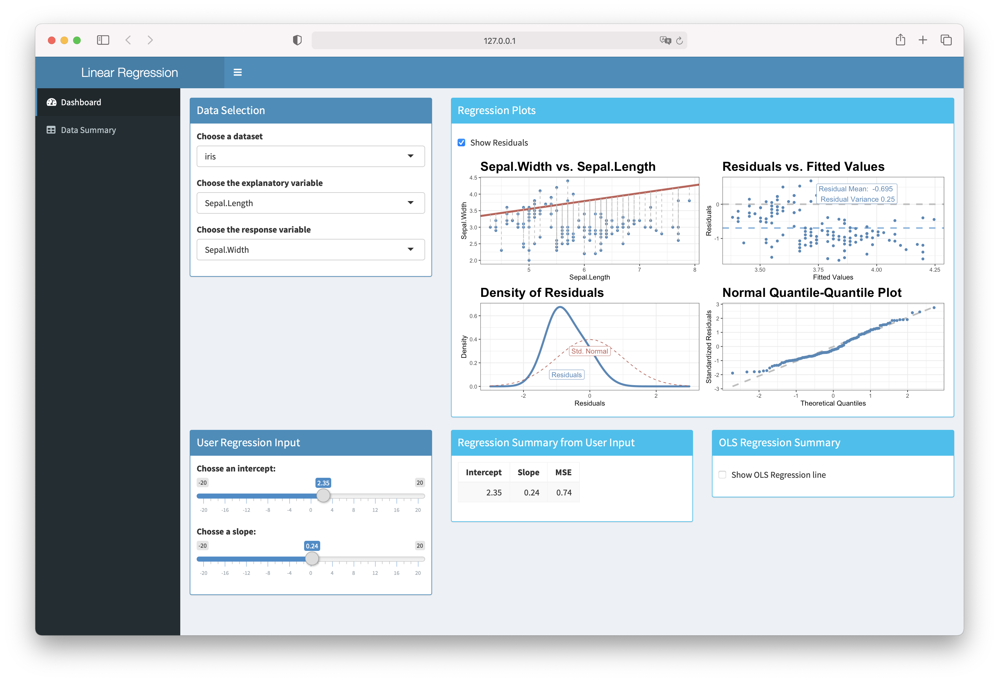
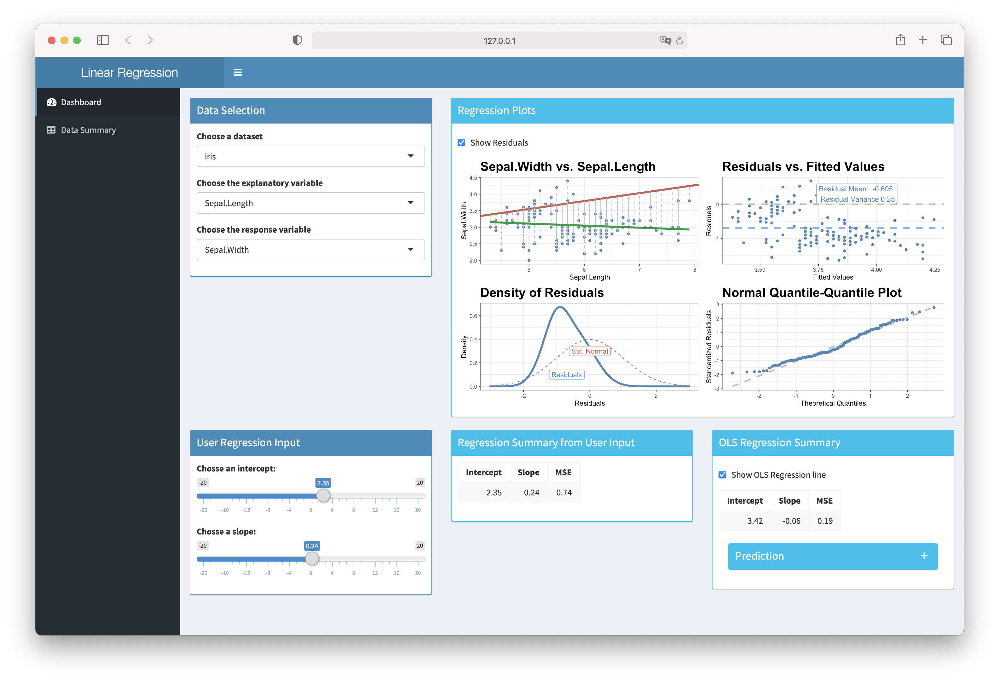

# Simple Linear Regression Shiny App

The goal of this app is to facilitate learning simple linear regression.
The app provides the user with visualizations of how a linear regression
line is fitted, and how a certain choice of the regression parameters
effects the residuals of the model.

## Using the App

After opening the app, you will see two tabs in the sidebar: `Dashboard`
and `Data Summary`.

  - `Dashboard` includes options for the users to select variables from
    one of the data sets provided, fit a simple linear regression model,
    and examine the fitted line and residuals.

  - `Data Summary` shows the selected data set, together with its
    five-number summary table.

For illustrations of how the app works, `iris` is the data set selected,
the explanatory and response variables are `Sepal.Length` and
`Sepal.Width` respectively.

### Dashboard Tab

When first opened, this is the default view of the app:

The app comes with some data sets that the user can choose. A data set
can be selected from a drop-down menu in the `Data Selection` panel.

The explanatory and response variables can be selected from the same
panel. 

Once the explanatory and response variables are selected, a scatter plot
is shown on the `Regression Plots` panel. The red line on the scatter
plot is a fitted line of which the user can adjust intercept and slope
by using the sliders in `User Regression Input`. The chosen line will
then be shown on the scatter plot, giving a visualization of how well
this line fits the data. Along with this, `Regression Summary from User
Input` shows the intercept and slope of the line the user selects, as
well as the value of its Mean Squared Error (MSE).

With the selected line, the user can examine the residuals by clicking
on the check box of `Show Residuals`. When this is checked, three
residuals plots will be shown with respect to the selected line. From
these additional plots, the user can observe how changing the fitted
line, using the sliders, changes the residuals and assess violations of
regression assumptions.

The app also provides the user with an ordinary least squares (OLS)
regression line. On the panel titled `OLS Regression Summary`, the user
can check on `Show OLS Regression line` to see the best fitted line in
green on the scatter plot. The slope and intercept of the best estimated
line, together with its MSE are also shown on this panel.

Another feature that the app has is providing predictions. The user can
enter a numerical value in `x-value for prediction` and the app will
give the corresponding `Predicted y-value` based on the OLS regression
line.  

When the x-value entered is out of the range of the explanatory
variable, the message `Extrapolation is not advised!` is printed as a
reminder to the learner. For instance, `Sepal.Length` ranges from around
4 to 8, and thus, predicting the width of a sepal of length 10 using the
OLS regression line is an extrapolation:

To identify where this predicted value is on the scatter plot, the user
can check the `Show Prediction` box, then only the scatter plot will be
shown, and the predicted value can be seen as a red dot on the green OLS
regression line.

### Data Summary Tab

The `Data Summary` tab provides the user with an overview of the data
set the user selects previously in `Dashboard`. A five-number summary of
this data set is also printed on this tab.

This is how this tab looks like when the user selects `iris` as the data
set. 
